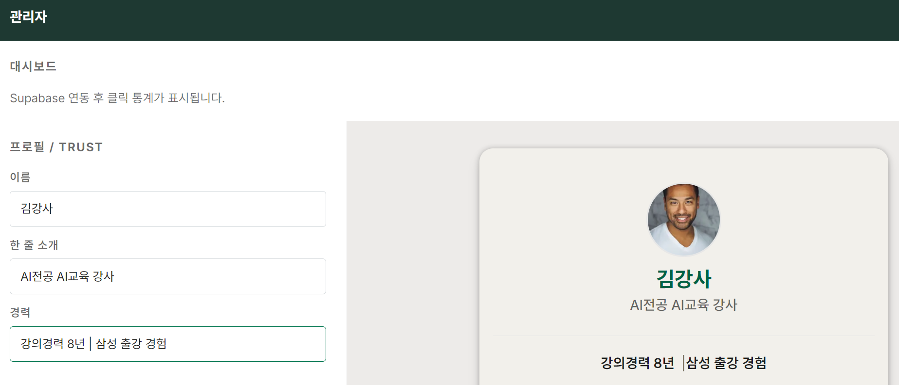

# Live Preview (실시간 미리보기)

**완료한 task:** `4. Admin 페이지 > 4-6. Live Preview`  
**생성/수정 파일:** `components/admin/AdminClient.tsx`, `app/admin/page.tsx`, `app/globals.css`

---

## 이 문서를 읽고 나면 풀 수 있어요

1. 두 컴포넌트가 같은 데이터를 공유하려면 공통 부모가 그 데이터를 가지고 있어야 한다.
2. 설정 폼과 미리보기가 각자 별도의 상태를 가져야 실시간 반영이 된다.
3. React는 상태가 바뀌면 그 상태를 읽는 컴포넌트를 자동으로 다시 그린다.

---

## 무엇을 했나?

설정 패널의 입력값이 바뀌면 오른쪽 미리보기에 즉시 반영되도록 구현했다.  
이름, 한 줄 소개, 경력 필드를 수정하면 저장 없이 미리보기가 실시간으로 갱신된다.



---

## 핵심 개념 1: 상태 끌어올리기 (State Lifting)

설정 폼과 미리보기는 **같은 데이터**를 바라봐야 한다.  
두 컴포넌트가 데이터를 공유하려면 그 데이터를 **둘의 공통 부모**가 가지고 있어야 한다.

```
AdminClient (상태 보관)
├── 설정 패널 → profile 상태를 읽고 onChange로 수정
└── Live Preview → profile 상태를 읽어서 렌더링
```

```
AdminClient (profile 데이터 보관)
  ├── 설정 패널 → profile 읽고, 입력 시 수정
  └── 미리보기  → profile 읽어서 화면에 표시
```

`profile.name`이 바뀌면 React가 자동으로 미리보기를 다시 그린다.

- ❌ 과거: `"폼 바꾸면 미리보기에 바로 반영되게 해줘"`
- ✅ 현재: `"profile state를 AdminClient로 끌어올려서 설정 패널이랑 미리보기가 같은 state 공유하게 해줘"`

---

## 다음 단계

- Supabase 연동 후 저장 버튼 → DB `UPDATE` 호출
- 링크 목록도 상태로 관리해서 링크 추가/삭제 시 미리보기 즉시 반영

---

## 이렇게 확인하세요

1. 터미널에서 `npm run dev` 실행
2. 브라우저에서 `http://localhost:3000/admin` 접속
3. 좌측 설정 패널의 **이름** 입력란 수정
4. 저장 버튼을 누르지 않아도 오른쪽 미리보기에 이름이 즉시 바뀌는지 확인
5. **한 줄 소개**, **경력** 필드도 동일하게 실시간 반영되는지 확인

---

## 퀴즈 정답

1. 두 컴포넌트가 같은 데이터를 공유하려면 공통 부모가 그 데이터를 가지고 있어야 한다. → **O**  
   ↳ 이를 "상태 끌어올리기(State Lifting)"라고 한다.

2. 설정 폼과 미리보기가 각자 별도의 상태를 가져야 실시간 반영이 된다. → **X**  
   ↳ 같은 상태를 공유해야 한다. 각자 별도 상태면 서로 독립적으로 움직인다.

3. React는 상태가 바뀌면 그 상태를 읽는 컴포넌트를 자동으로 다시 그린다. → **O**  
   ↳ React의 핵심 동작 원리다.
