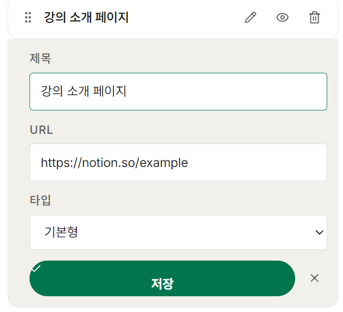

# 링크 수정 인라인 에디터

**완료한 task:** `4. Admin 페이지 > 4-3. Link Manager > 링크 수정 인라인 에디터`  
**수정 파일:** `components/admin/LinkEditor.tsx`, `app/globals.css`

---

## 이 문서를 읽고 나면 풀 수 있어요

1. 인라인 편집 중 입력한 내용은 저장 버튼을 누르기 전까지 실제 데이터에 반영되지 않는다.
2. 취소 버튼을 누르면 편집 draft가 초기화되어 원래 값으로 돌아온다.
3. 인라인 폼은 기본 행 위에 별도 레이어로 떠 있는 방식으로 구현됐다.

---

## 무엇을 했나?

각 링크 행의 연필 아이콘을 클릭하면 바로 아래 편집 폼이 펼쳐진다.  
제목, URL, 타입을 수정하고 저장하면 목록과 Live Preview에 즉시 반영된다. 취소하면 원래 값으로 돌아온다.




---


저장 버튼을 누르기 전까지는 `draft`만 바뀌고 실제 `link` 데이터는 그대로다.  
Supabase 연동 후에는 `saveEdit`에서 DB UPDATE를 호출하고, 실패 시 `cancelEdit`로 롤백한다.

- ❌ 과거: `"수정 취소하면 원래대로 돌아오게 해줘"`
- ✅ 현재: `"편집 중에는 draft state만 바꾸고, 저장 버튼 눌러야 links state에 반영해줘. 취소하면 draft를 null로 리셋해줘"`

---

## 핵심 개념 3: 인라인 폼 UI 구조

```
┌─────────────────────────────────┐  ← link-editor__row (기본 행)
│ ⠿  카카오톡 문의  ✏️  👁  🗑️   │
└─────────────────────────────────┘
┌─────────────────────────────────┐  ← link-editor__inline-form (편집 시 노출)
│  제목: [__________]             │
│  URL:  [__________]             │
│  타입: [기본형   ▼]             │
│  [✓ 저장]  [✕]                 │
└─────────────────────────────────┘
```

`border-top: none`으로 기본 행과 인라인 폼이 하나처럼 붙어 보이도록 했다.

---

## 다음 단계

- Supabase 연동 후 `saveEdit`의 TODO에서 `links` 테이블 UPDATE 호출
- 저장 실패 시 `cancelEdit`로 롤백

---

## 이렇게 확인하세요

1. 터미널에서 `npm run dev` 실행
2. 브라우저에서 `http://localhost:3000/admin` 접속
3. 링크 행 오른쪽 ✏️ 연필 아이콘 클릭 → 행 아래에 편집 폼이 펼쳐지는지 확인
4. 제목을 수정하고 **저장** 클릭 → 목록과 미리보기에 반영되는지 확인
5. 다시 연필 클릭 후 **✕** 클릭 → 원래 값으로 돌아오는지 확인

---

## 퀴즈 정답

1. 인라인 편집 중 입력한 내용은 저장 버튼을 누르기 전까지 실제 데이터에 반영되지 않는다. → **O**  
   ↳ `draft` state에만 변경이 반영되고, 저장 시 실제 `links` state에 반영된다.

2. 취소 버튼을 누르면 편집 draft가 초기화되어 원래 값으로 돌아온다. → **O**  
   ↳ `draft`를 `null`로 리셋하면 편집 모드가 종료되고 원래 값이 보인다.

3. 인라인 폼은 기본 행 위에 별도 레이어로 떠 있는 방식으로 구현됐다. → **X**  
   ↳ 행 바로 아래에 붙는 구조다. `border-top: none`으로 하나처럼 보이게 했다.
