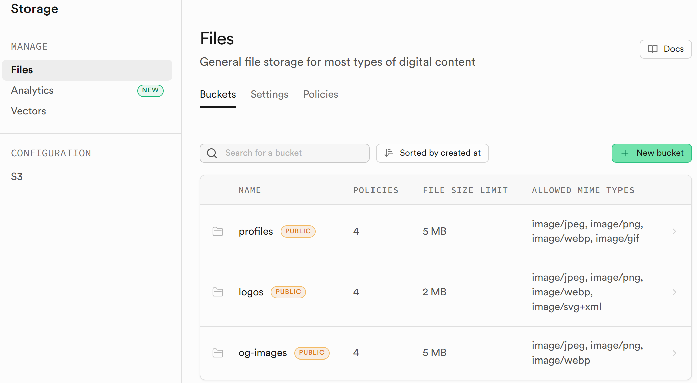

# Supabase Storage 버킷 생성 및 정책 설정

**완료한 task:** `1. Supabase DB & 보안 > Storage 버킷 생성`  
**관련 파일:** Supabase 대시보드 (코드 파일 없음)

---

## 이 문서를 읽고 나면 풀 수 있어요

1. Supabase Storage의 버킷은 구글 드라이브의 폴더와 비슷한 개념이다.
2. `public: true` 버킷에 저장된 파일은 URL만 알면 로그인 없이 볼 수 있다.
3. 허용 MIME 타입을 설정하면 목록에 없는 파일 형식은 업로드가 차단된다.
4. jpg 파일을 Supabase Storage에 올리면 자동으로 webp로 변환된다.

---

## 버킷(Bucket)이란?

버킷은 **클라우드에 파일을 보관하는 폴더**다.

구글 드라이브에 폴더를 만들어 파일을 올리는 것과 같은 원리다.  
이 프로젝트에서는 Supabase Storage에 3개의 버킷을 만들어 각 용도별로 이미지를 저장한다.

```
구글 드라이브               Supabase Storage
────────────────────        ──────────────────────
내 드라이브 (전체)    ←→    Storage (전체)
  📁 프로필 사진      ←→      버킷: profiles
  📁 로고 모음        ←→      버킷: logos
  📁 SNS 썸네일       ←→      버킷: og-images
```

파일 하나를 올리면 고유한 URL이 생긴다.  
그 URL을 DB에 저장해 두면 페이지에서 이미지를 불러올 수 있다.

```
파일 업로드 → Supabase Storage URL 발급
→ DB의 image_url 컬럼에 저장
→ 페이지에서 URL로 이미지 표시
```

---

## 무엇을 했나?

Supabase Storage에 3개의 버킷을 생성하고, 각 버킷에 접근 정책을 설정했다.

```
Supabase Storage
┌─────────────────────────────────────────────────────────┐
│  버킷 목록                                               │
│                                                         │
│  ┌───────────────┐  ┌───────────────┐  ┌─────────────┐ │
│  │  profiles     │  │    logos      │  │  og-images  │ │
│  │  public: true │  │  public: true │  │ public: true│ │
│  │  max: 5MB     │  │  max: 2MB     │  │  max: 5MB   │ │
│  │  jpg/png/     │  │  jpg/png/     │  │  jpg/png/   │ │
│  │  webp/gif     │  │  webp/svg     │  │  webp       │ │
│  └───────────────┘  └───────────────┘  └─────────────┘ │
│                                                         │
│  접근 정책                                               │
│  ┌──────────────────────────────────────────────────┐   │
│  │  읽기  → 누구나 (public)                          │   │
│  │  업로드 → 로그인한 사용자만                        │   │
│  │  수정  → 로그인한 사용자만                         │   │
│  │  삭제  → 로그인한 사용자만                         │   │
│  └──────────────────────────────────────────────────┘   │
└─────────────────────────────────────────────────────────┘
```

---

## 버킷 구성

| 버킷 ID | 용도 | 최대 크기 | 허용 형식 |
|---|---|---|---|
| `profiles` | 강사 프로필 사진 | 5 MB | jpeg, png, webp, gif |
| `logos` | 기업 클라이언트 로고 | 2 MB | jpeg, png, webp, svg |
| `og-images` | SEO OG 이미지 | 5 MB | jpeg, png, webp |

### 허용 MIME이란?

MIME(마임)은 **파일이 어떤 종류인지 브라우저에 알려주는 꼬리표**다.

파일 확장자(`.jpg`, `.png`)와 비슷하지만, 확장자는 이름을 바꾸면 속일 수 있다.  
MIME 타입은 파일 내용 자체를 보고 판단하기 때문에 더 정확하다.

```
파일 확장자      MIME 타입
─────────────────────────────────
.jpg / .jpeg  →  image/jpeg
.png          →  image/png
.webp         →  image/webp
.gif          →  image/gif
.svg          →  image/svg+xml
```

버킷에 허용 MIME을 설정하면, 목록에 없는 형식(예: `.pdf`, `.mp4`)은 업로드 자체가 차단된다.  
이미지 버킷에 엉뚱한 파일이 올라오는 것을 막기 위한 안전장치다.

### webp란?

webp는 구글이 만든 이미지 형식이다. 같은 품질의 사진을 jpg보다 25~35% 더 작게 저장한다.

```
같은 사진, 같은 품질 기준:
  photo.jpg   →  320 KB
  photo.webp  →  210 KB  (약 34% 절약)
```

웹사이트에서 webp를 쓰는 이유:
- 파일이 작을수록 페이지 로딩이 빠름
- 빠른 로딩 = 구글 SEO 점수 상승
- 모바일 데이터 절약

이 프로젝트에서 `next/image`를 쓰면 jpg·png를 올려도 Next.js가 자동으로 webp로 변환해서 브라우저에 전달한다. 직접 webp를 만들 필요가 없다.

**변환 전용 폴더는 없다.** 이미지는 그냥 `public/` 폴더에 넣으면 된다.  
변환은 배포 시점이 아니라, **브라우저가 처음 요청하는 순간** 서버가 실행한다.

```
[ 개발자가 하는 일 ]
  photo.jpg  →  public/ 폴더에 넣기
  코드에서   →  <Image src="/photo.jpg" /> 사용

[ 브라우저가 페이지를 열면 ]
  브라우저 요청
      ↓
  Next.js 이미지 서버가 photo.jpg를 읽음
      ↓
  webp로 변환 + 화면 크기에 맞게 리사이즈
      ↓
  브라우저 수신: photo.webp (더 작은 파일)
      ↓
  변환 결과를 서버에 캐시 → 다음 요청부터는 변환 없이 즉시 응답
```

정리하면:
- 별도 폴더 생성 → 필요 없음
- 배포할 때 변환 → X, 첫 요청 때 변환
- 같은 이미지를 두 번째 열면 → 이미 변환된 캐시를 바로 전달

---

## 핵심 개념 1: `public: true` 버킷

버킷을 `public: true`로 설정하면 URL만 알면 별도 로그인 없이 파일을 읽을 수 있다.  
공개 페이지에서 이미지를 보여줄 때 토큰이 필요 없어지므로, URL을 `next/image`의 `src`에 바로 넣을 수 있다.

```
파일 URL 형식:
https://<project-ref>.supabase.co/storage/v1/object/public/<버킷>/<파일경로>
```

- ❌ 과거: `"프로필 이미지 올리면 로그인 없이 볼 수 있게 해줘"`
- ✅ 현재: `"profiles 버킷을 public: true로 설정해줘"`

---

## 핵심 개념 2: 파일 크기 제한과 허용 형식

버킷 생성 시 최대 파일 크기와 허용 형식을 지정하면, Supabase가 업로드 단계에서 자동으로 검증한다.  
코드에서 별도로 체크하지 않아도 규격 밖의 파일은 거부된다.

- ❌ 과거: `"로고 업로드할 때 5MB 넘으면 막아줘"`
- ✅ 현재: `"logos 버킷의 파일 크기 제한을 2MB로 설정해줘"`

---

## 이렇게 확인하세요

1. [supabase.com](https://supabase.com) 접속 → 프로젝트 선택
2. 좌측 메뉴 **Storage** 클릭
3. `profiles`, `logos`, `og-images` 버킷 3개가 생성됐는지 확인

4. 버킷 하나를 클릭 → **Upload file** 버튼으로 이미지 파일 업로드 테스트
5. 업로드된 파일 클릭 → URL 복사 후 브라우저 주소창에 붙여넣기 → 이미지가 바로 열리는지 확인 (public 설정 확인)

---

## 퀴즈 정답

1. Supabase Storage의 버킷은 구글 드라이브의 폴더와 비슷한 개념이다. → **O**  
   ↳ 버킷 = 용도별 폴더. 파일을 올리면 고유 URL이 생긴다.

2. `public: true` 버킷에 저장된 파일은 URL만 알면 로그인 없이 볼 수 있다. → **O**  
   ↳ 공개 페이지에서 프로필 이미지나 로고를 로그인 없이 보여주기 위해 public으로 설정한다.

3. 허용 MIME 타입을 설정하면 목록에 없는 파일 형식은 업로드가 차단된다. → **O**  
   ↳ `.pdf`, `.mp4` 같은 파일이 이미지 버킷에 올라오는 것을 막는 안전장치다.

4. jpg 파일을 Supabase Storage에 올리면 자동으로 webp로 변환된다. → **X**  
   ↳ Storage는 원본 그대로 저장한다. webp 변환은 `next/image`가 브라우저에 전달할 때 처리한다.
